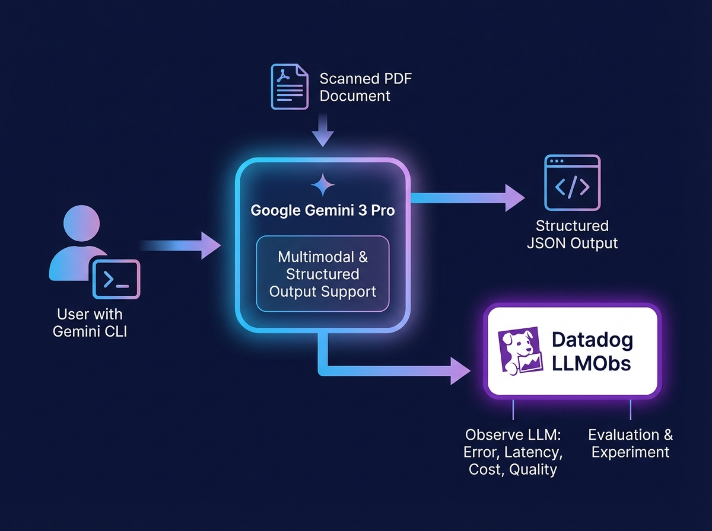

# Thailand Election Skills



AI-powered skills for extracting and processing data from Thailand 2026 election documents.

## Table of Contents

- [Thailand Election Skills](#thailand-election-skills)
  - [Table of Contents](#table-of-contents)
  - [Overview](#overview)
  - [Features](#features)
  - [Prerequisites](#prerequisites)
  - [Installation](#installation)
    - [1. Clone the Repository](#1-clone-the-repository)
    - [2. Install Gemini CLI](#2-install-gemini-cli)
    - [3. Configure API Key](#3-configure-api-key)
    - [4. Install Skill to Your Agent (Optional)](#4-install-skill-to-your-agent-optional)
    - [5. Use Claude AI Agent (Recommended for All Users)](#5-use-claude-ai-agent-recommended-for-all-users)
      - [For Single PDF Extraction](#for-single-pdf-extraction)
      - [For Batch Processing (Multiple PDFs)](#for-batch-processing-multiple-pdfs)
      - [Example Prompts You Can Use](#example-prompts-you-can-use)
    - [Alternative: Manual Command Line (For Technical Users)](#alternative-manual-command-line-for-technical-users)
  - [Usage](#usage)
    - [Recommended: Ask Claude AI Agent](#recommended-ask-claude-ai-agent)
      - [Common Tasks](#common-tasks)
    - [What the AI Agent Does Behind the Scenes](#what-the-ai-agent-does-behind-the-scenes)
  - [Output Format](#output-format)
    - [Field Descriptions](#field-descriptions)
  - [Troubleshooting](#troubleshooting)
    - [Common Issues](#common-issues)
      - [If Using Claude AI Agent (Recommended)](#if-using-claude-ai-agent-recommended)
      - [If Using Manual Commands](#if-using-manual-commands)
  - [Getting Help](#getting-help)
  - [Why Use Claude AI Agent?](#why-use-claude-ai-agent)

## Overview

This project provides AI-powered skills for extracting structured policy information from Thai political party documents. Using Google's Gemini 3 Pro Preview model, it can accurately read Thai language PDFs and extract detailed policy data including budgets, funding sources, benefits, and risks.

The extracted data is output in a clean, validated JSON format suitable for analysis and visualization.

## Features

- **Thai Language OCR**: Accurately reads Thai text and numerals from PDFs
- **Structured JSON Output**: Extracts data into a clean, validated JSON format with Pydantic schemas
- **Comprehensive Data Extraction**: Captures 9 distinct fields for each policy including:
  - Policy sequence, category, and name
  - Budget (normalized to Baht)
  - Funding source
  - Cost-effectiveness analysis
  - Benefits, impacts, and risks
- **Budget Normalization**: Automatically converts Thai budget units (ล้าน, พันล้าน, etc.) into numerical Baht values
- **Batch Processing**: Process multiple PDF files with automatic retry and skip functionality
- **Robust Error Handling**: Includes automatic retries and detailed logging for troubleshooting

## Prerequisites

Before you begin, ensure you have:

- **Python 3.10 or higher** installed on your system
- **Node.js and npm** (for Gemini CLI and npx)
- **A Google Gemini API key** - Get one at [https://aistudio.google.com/api-keys](https://aistudio.google.com/api-keys)

## Installation

> **💡 Quick Start:** If you're using Claude AI agent, skip to [section 5](#5-use-claude-ai-agent-recommended-for-all-users) - the agent will handle setup automatically!

### 1. Clone the Repository

First, clone this repository to your local machine:

```bash
git clone https://github.com/nuttea/thailand-election-skills.git
cd thailand-election-skills
```

### 2. Install Gemini CLI

Install the Google Gemini CLI globally:

```bash
npm install -g @google/gemini-cli
```

### 3. Configure API Key

Create a `.env` file from the example:

```bash
cp .env.example .env
```

Edit the `.env` file and add your Gemini API key:

```bash
GEMINI_API_KEY=your_api_key_here
```

Load the environment variables:

```bash
source .env
```

### 4. Install Skill to Your Agent (Optional)

If you already have Claude Code or Gemini CLI agent installed and want to add this skill to your existing setup:

```bash
npx skills add nuttea/thailand-election-skills --skill extract-thailand-election-policies --agent gemini-cli --agent claude-code --yes
```

This command will:
- ✅ Download and install the skill to your agent
- ✅ Make it available across all your projects
- ✅ Enable you to use the skill with simple prompts like "Extract Thai election policies"

**Skip this step if:** You cloned the repository and are working within it - the skill is already available locally.

### 5. Use Claude AI Agent (Recommended for All Users)

**No coding or terminal commands needed!** Simply open Claude and ask the AI agent to handle everything for you.

#### For Single PDF Extraction

Open Claude (or Claude Code) and ask:

```
Please use the extract-thailand-election-policies skill to extract policies from this PDF:
/path/to/your/party_policy.pdf

Save the output to: party_policies.json
```

The AI agent will automatically:
- ✅ Set up the Python virtual environment
- ✅ Install all required dependencies
- ✅ Run the extraction process
- ✅ Handle any errors and retry if needed
- ✅ Save the output JSON file

#### For Batch Processing (Multiple PDFs)

Ask Claude:

```
Please use the extract-thailand-election-policies skill to batch extract all PDFs from:
assets/นโยบายพรรคการเมือง/

Save outputs to: all_parties_output/
```

The AI agent will process all PDFs and provide status updates.

#### Example Prompts You Can Use

**Extract a single PDF:**
```
use thailand election skill, extract policies from ""assets/นโยบายพรรคการเมือง/เบอร์ 46 พรรคประชาชน.pdf"
```

**Batch process all PDFs:**
```
Run batch extraction on all Thai election PDFs in the assets folder
```

**Convert to CSV:**
```
Convert the JSON output to CSV format with pipe delimiter
```

### Alternative: Manual Command Line (For Technical Users)

If you prefer to run commands directly in the terminal:

<details>
<summary>Click to expand manual installation steps</summary>

```bash
cd .claude/skills/extract-thailand-election-policies

# Create virtual environment
python3 -m venv .venv

# Activate virtual environment
source .venv/bin/activate

# Install dependencies
pip install -r requirements.txt
```

**Single PDF extraction:**
```bash
python scripts/extract_policy.py \
  --pdf-path "/path/to/your/party_policy.pdf" \
  --output-file "/path/to/your/output.json"
```

**Batch extraction:**
```bash
bash scripts/batch_extract_all.sh
```

</details>

## Usage

### Recommended: Ask Claude AI Agent

The easiest way to use this tool is to simply ask Claude to do the work for you. Claude has access to the `extract-thailand-election-policies` skill and will handle all technical details automatically.

#### Common Tasks

**Extract a single party's policies:**
```
Extract policies from "assets/นโยบายพรรคการเมือง/เบอร์ 46 พรรคประชาชน.pdf"
```

**Process all PDFs in a directory:**
```
Batch extract all Thai election PDFs
```

**Convert output to CSV:**
```
Convert party_46_policies.json to CSV format
```

**Analyze the data:**
```
Show me a summary of all policies with budgets over 100 billion Baht
```

### What the AI Agent Does Behind the Scenes

When you ask Claude to extract policies, it automatically:

1. **Sets up environment** - Creates Python virtual environment if needed
2. **Installs dependencies** - Installs required packages (google-genai, pydantic, etc.)
3. **Runs extraction** - Executes the extraction script with optimal parameters
4. **Handles errors** - Automatically retries on failures (up to 3 times)
5. **Validates output** - Ensures JSON is valid and complete
6. **Provides updates** - Shows progress and completion status

## Output Format

The extraction generates a JSON file with the following structure:

```json
{
  "policies": [
    {
      "policy_seq": 1,
      "policy_category": "โครงสร้างพื้นฐาน",
      "policy_name": "ระบบรางความเร็วสูง",
      "budget_baht": 350000000000,
      "funding_source": "๑) งบประมาณแผ่นดิน\n๒) PPP\n๓) พันธบัตร",
      "cost_effectiveness": "ลดต้นทุนโลจิสติกส์...",
      "benefits": "๑) เพิ่มการเชื่อมต่อ\n๒) กระตุ้นเศรษฐกิจ",
      "impacts": "ผลกระทบระยะยาว...",
      "risks": "ความเสี่ยงทางการเงิน..."
    }
  ]
}
```

### Field Descriptions

| Field | Type | Description |
|-------|------|-------------|
| `policy_seq` | integer | Sequence number of the policy |
| `policy_category` | string | Policy category (e.g., "Public Health", "Education") |
| `policy_name` | string | Name or title of the policy |
| `budget_baht` | integer | Budget amount in Thai Baht |
| `funding_source` | string | Description of funding sources |
| `cost_effectiveness` | string | Analysis of cost-effectiveness |
| `benefits` | string | Described benefits of the policy |
| `impacts` | string | Potential impacts of the policy |
| `risks` | string | Identified risks and challenges |

## Troubleshooting

### Common Issues

#### If Using Claude AI Agent (Recommended)

**Agent says skill is not found:**
- Make sure you're in the correct project directory
- Try: "List available skills" to see if the skill is loaded

**Extraction fails or times out:**
- Simply ask Claude to retry: "Please try extracting that PDF again"
- The agent will automatically handle retries and different approaches

**API key errors:**
- Check that your `.env` file has the correct `GEMINI_API_KEY`
- Ask Claude: "Can you verify my Gemini API key is set up correctly?"

**PDF processing issues:**
- Ask Claude: "Why did the extraction fail for this PDF?"
- The agent will analyze error logs and provide specific guidance

#### If Using Manual Commands

<details>
<summary>Click for manual troubleshooting steps</summary>

**Virtual environment not activated:**
```bash
# You should see (.venv) in your prompt. If not:
source .venv/bin/activate
```

**Missing API key:**
```bash
# Ensure .env file exists and is loaded:
source .env
echo $GEMINI_API_KEY  # Should display your key
```

**PDF processing fails:**
- Check that the PDF file path is correct and accessible
- Ensure the PDF contains Thai text (not scanned images without OCR)
- Review the log output for specific error messages
- The script will automatically retry failed extractions

**Import errors:**
```bash
# Reinstall dependencies:
pip install -r requirements.txt --force-reinstall
```

</details>

## Getting Help

**Using Claude AI Agent:**
Simply describe your issue to Claude:
```
I'm having trouble extracting policies from this PDF: [filename]
The error message says: [error]
```

**GitHub Issues:**
For bug reports or feature requests, please open an issue at the project repository.

---

## Why Use Claude AI Agent?

✅ **No coding required** - Just describe what you want in plain language
✅ **Automatic setup** - Agent handles all technical configuration
✅ **Error recovery** - Agent automatically troubleshoots and retries
✅ **Flexible** - Works with any PDF structure or format
✅ **Interactive** - Ask follow-up questions and refine results

**Example conversation with Claude:**

> **You:** Extract policies from all Thai election PDFs
>
> **Claude:** I'll extract policies from all PDFs in the assets directory. Let me set up the environment and start processing...
>
> [Claude automatically sets up Python environment, installs packages, and runs batch extraction]
>
> **Claude:** ✅ Successfully extracted 51 parties with 587 policies total. Output saved to `all_parties_output/`
>
> **You:** Can you convert these to CSV and show me the top 10 most expensive policies?
>
> **Claude:** Sure! Converting to CSV and analyzing...

---

For more technical details, see [.claude/skills/extract-thailand-election-policies/SKILL.md](.claude/skills/extract-thailand-election-policies/SKILL.md)
